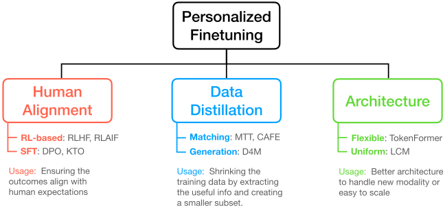

# Awesome-Personalized-Finetuning

## Table of Contents

- [Awesome-Personalized-Finetuning](#awesome-personalized-finetuning)
  - [Table of Contents](#table-of-contents)
  - [Papers](#papers)
    - [Human Alignment](#human-alignment)
      - [Fundamental Approach](#fundamental-approach)
      - [Application](#application)
    - [Data Distillation](#data-distillation)
      - [Survey](#survey)
      - [Fundamental Approach](#fundamental-approach-1)
      - [Application](#application-1)
    - [Archiecture](#archiecture)
  - [Acknowledgement](#acknowledgement)

---

## Papers

### Human Alignment

This section focuses on the fundamental approach and the applications by training the model to align the human preference.

#### Fundamental Approach

| Title                                                                                                                                | Venue   | Year | Code                                                                              | Keywords           |
| ------------------------------------------------------------------------------------------------------------------------------------ | ------- | ---- | --------------------------------------------------------------------------------- | ------------------ |
| [Training language models to follow instructions with human feedback](https://arxiv.org/abs/2203.02155)                              | NeurlPS | 2022 | [OpenRLHF](https://github.com/OpenRLHF/OpenRLHF)                                  | RLHF               |
| [SLiC-HF: Sequence Likelihood Calibration with Human Feedback](https://arxiv.org/abs/2305.10425)                                     | ICLR    | 2023 | [Non-Official](https://github.com/Ghost---Shadow/sequence-likelihood-calibration) | SLiC-HF            |
| [Direct Preference Optimization: Your Language Model is Secretly a Reward Model](https://arxiv.org/abs/2305.18290)                   | NeurlPS | 2023 | [OpenRLHF](https://github.com/OpenRLHF/OpenRLHF)                                  | DPO                |
| [RAFT: Reward rAnked FineTuning for Generative Foundation Model Alignment](https://arxiv.org/abs/2304.06767)                         | TMLR    | 2023 | [Official](https://github.com/RLHFlow/RAFT)                                       | RAFT               |
| [Back to Basics: Revisiting REINFORCE-Style Optimization for Learning from Human Feedback in LLMs](https://arxiv.org/abs/2402.14740) | ACL     | 2024 | [OpenRLHF](https://github.com/OpenRLHF/OpenRLHF)                                  | RLOO               |
| [Self-Play Fine-Tuning Converts Weak Language Models to Strong Language Models](https://arxiv.org/abs/2401.01335)                    | ICML    | 2024 | [Official](https://github.com/uclaml/SPIN)                                        | SPIN               |
| [A General Theoretical Paradigm to Understand Learning from Human Preferences](https://arxiv.org/abs/2310.12036)                     | AISTATS | 2024 | [OpenRLHF](https://github.com/OpenRLHF/OpenRLHF)                                  | IPO                |
| [Statistical rejection sampling improves preference optimization](https://arxiv.org/abs/2309.06657)                                  | ICLR    | 2024 | [Official](https://github.com/uclaml/SPIN)                                        | Rejection Sampling |
| [SimPO: Simple Preference Optimization with a Reference-Free Reward](https://arxiv.org/abs/2405.14734)                               | NeurlPS | 2024 | [Official](https://github.com/princeton-nlp/SimPO)                                | SimPO              |
| [KTO: Model Alignment as Prospect Theoretic Optimization](https://arxiv.org/abs/2402.01306)                                          | ICML    | 2024 | [OpenRLHF](https://github.com/OpenRLHF/OpenRLHF)                                  | KTO                |
| [RLAIF vs. RLHF: Scaling Reinforcement Learning from Human Feedback with AI Feedback](https://arxiv.org/pdf/2309.00267)              | ICML    | 2024 |                                                                                   | RLAIF              |
| [RLHF Workflow: From Reward Modeling to Online RLHF](https://arxiv.org/abs/2405.07863)                                               | TMLR    | 2024 | [Official](https://github.com/RLHFlow/RLHF-Reward-Modeling)                       | Online-RLHF        |

#### Application

| Title                                                                                                                                      | Venue   | Year | Code                                                             | Keywords      |
| ------------------------------------------------------------------------------------------------------------------------------------------ | ------- | ---- | ---------------------------------------------------------------- | ------------- |
| [RLHF-V: Towards Trustworthy MLLMs via Behavior Alignment from Fine-grained Correctional Human Feedback](https://arxiv.org/abs/2312.00849) | CVPR    | 2024 | [Official](https://github.com/RLHF-V/RLHF-V)                     | RLHF-V        |
| [Diffusion Model Alignment Using Direct Preference Optimization](https://arxiv.org/abs/2311.12908)                                         | CVPR    | 2024 | [Official](https://github.com/SalesforceAIResearch/DiffusionDPO) | DiffusionDPO  |
| [Training Diffusion Models with Reinforcement Learning](https://arxiv.org/abs/2305.13301)                                                  | ICLR    | 2024 | [Official](https://github.com/jannerm/ddpo)                      | DDPO          |
| [RL-VLM-F: Reinforcement Learning from Vision Language Foundation Model Feedback](https://arxiv.org/abs/2402.03681)                        | ICML    | 2024 | [Official](https://github.com/yufeiwang63/RL-VLM-F)              | RL-VLM-F      |
| [Aligning Diffusion Models by Optimizing Human Utility](https://arxiv.org/abs/2404.04465)                                                  | NeurlPS | 2024 | [Official](https://github.com/jacklishufan/diffusion-kto)        | Diffusion-KTO |

### Data Distillation

#### Survey

| Title                                                                              | Venue  | Year |
| ---------------------------------------------------------------------------------- | ------ | ---- |
| [Data Distillation: A Survey](https://arxiv.org/abs/2301.04272)                    | TMLR   | 2023 |
| [A Comprehensive Survey of Dataset Distillation](https://arxiv.org/abs/2301.05603) | T-PAMI | 2024 |

#### Fundamental Approach

| Title                                                                                                                 | Venue   | Year | Code                                                                 | Keywords                 |
| --------------------------------------------------------------------------------------------------------------------- | ------- | ---- | -------------------------------------------------------------------- | ------------------------ |
| [Dataset Distillation](https://arxiv.org/abs/1811.10959)                                                              | arXiv   | 2018 | [Non-Official](https://github.com/ssnl/dataset-distillation)         |                          |
| [Dataset Condensation with Gradient Matching](https://arxiv.org/abs/2006.05929)                                       | ICLR    | 2021 | [Official](https://github.com/VICO-UoE/DatasetCondensation)          | gradient matching        |
| [CAFE: Learning to Condense Dataset by Aligning Features](https://arxiv.org/abs/2203.01531)                           | CVPR    | 2022 | [Official](https://github.com/kaiwang960112/CAFE)                    | CAFE                     |
| [Dataset Distillation by Matching Training Trajectories](https://arxiv.org/abs/2203.11932)                            | CVPR    | 2022 | [Official](https://github.com/GeorgeCazenavette/mtt-distillation)    | MTT, trajectory matching |
| [Towards Lossless Dataset Distillation via Difficulty-Aligned Trajectory Matching](https://arxiv.org/abs/2310.057730) | ICLR    | 2024 | [Official](https://gzyaftermath.github.io/DATM/)                     | lossless                 |
| [Multisize Dataset Condensation](https://arxiv.org/abs/2403.06075)                                                    | ICLR    | 2024 | [Official](https://github.com/he-y/Multisize-Dataset-Condensation)   | mltisize                 |
| [Embarassingly Simple Dataset Distillation](https://arxiv.org/abs/2311.07025)                                         | ICLR    | 2024 | [Official](https://github.com/fengyzpku/Simple_Dataset_Distillation) | RaT-BPTT                 |
| [D4M: Dataset Distillation via Disentangled Diffusion Model](https://arxiv.org/abs/2407.15138)                        | CVPR    | 2024 | [Official](https://github.com/suduo94/D4M)                           | D4M                      |
| [Dataset Distillation by Automatic Training Trajectories](https://arxiv.org/abs/2407.14245)                           | ECCV    | 2024 | [Official](https://github.com/NiaLiu/ATT)                            | ATT                      |
| [Elucidating the Design Space of Dataset Condensation](https://arxiv.org/abs/2404.13733)                              | NeurlPS | 2024 | [Official](https://github.com/shaoshitong/EDC)                       | EDC                      |

#### Application

| Title                                                                                                                | Venue | Year | Code                                                                                 | Keywords |
| -------------------------------------------------------------------------------------------------------------------- | ----- | ---- | ------------------------------------------------------------------------------------ | -------- |
| [Dataset Distillation with Attention Labels for Fine-tuning BERT](https://aclanthology.org/2023.acl-short.12/)       | ACL   | 2023 | [Official](https://github.com/arumaekawa/dataset-distillation-with-attention-labels) |          |
| [Vision-Language Dataset Distillation](https://arxiv.org/abs/2308.07545)                                             | TMLR  | 2024 | [Official](https://github.com/princetonvisualai/multimodal_dataset_distillation)     |          |
| [Low-Rank Similarity Mining for Multimodal Dataset Distillation](https://arxiv.org/abs/2406.03793)                   | ICML  | 2024 | [Official](https://github.com/silicx/LoRS_Distill)                                   | LoRS     |
| [Dancing with Still Images: Video Distillation via Static-Dynamic Disentanglement](https://arxiv.org/abs/2312.00362) | CVPR  | 2024 | [Official](https://github.com/yuz1wan/video_distillation)                            |          |
| [DiLM: Distilling Dataset into Language Model for Text-level Dataset Distillation](https://arxiv.org/abs/2404.00264) | NAACL | 2024 | [Official](https://github.com/arumaekawa/DiLM)                                       | DiLM     |
| [Textual Dataset Distillation via Language Model Embedding](https://aclanthology.org/2024.findings-emnlp.733/)       | EMNLP | 2024 | N/A                                                                                  |          |

### Archiecture

| Title                                                                                                           | Venue | Year | Code                                                                | Keywords    |
| --------------------------------------------------------------------------------------------------------------- | ----- | ---- | ------------------------------------------------------------------- | ----------- |
| [TokenFormer: Rethinking Transformer Scaling with Tokenized Model Parameters](https://arxiv.org/abs/2410.23168) | arXiv | 2024 | [Official](https://github.com/Haiyang-W/TokenFormer)                | TokenFormer |
| [Large Concept Models: Language modeling in a sentence representation space](https://arxiv.org/abs/2412.08821)  | arXiv | 2024 | [Official](https://github.com/facebookresearch/large_concept_model) | LCM         |
| [Byte Latent Transformer: Patches Scale Better Than Tokens](https://arxiv.org/pdf/2412.09871)                   | arXiv | 2024 | [Official](https://github.com/facebookresearch/blt)                 | BLT         |

## Acknowledgement

Thanks to the following repositories:

- [OpenRLHF](https://github.com/OpenRLHF/OpenRLHF)
- [awesome-RLHF](https://github.com/opendilab/awesome-RLHF)
- [Awesome Dataset Distillation](https://github.com/Guang000/Awesome-Dataset-Distillation)
